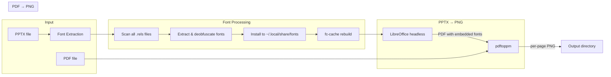
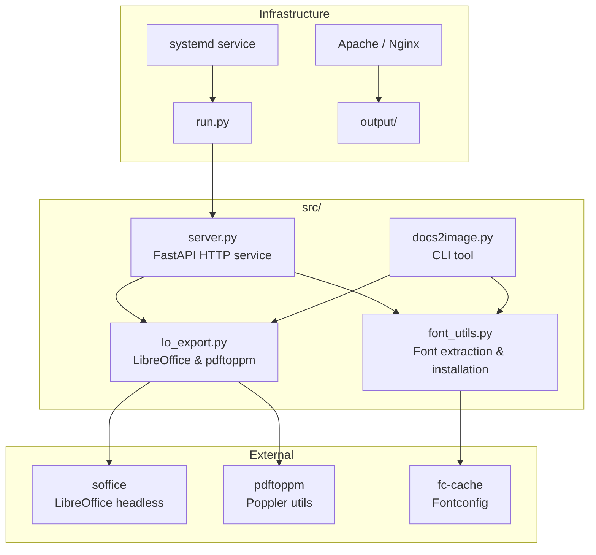
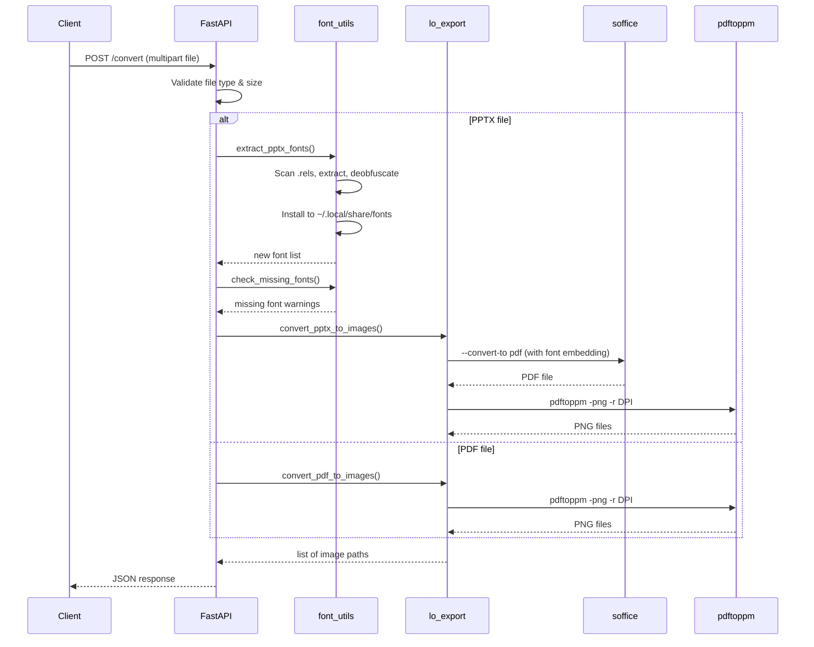

# Architecture

## System Overview

docs2image is a headless document-to-image conversion service. It accepts PDF and PPTX files via a REST API and returns high-fidelity PNG images of each page/slide.

## Conversion Pipeline



## Component Responsibilities



## Module Details

### `font_utils.py`

Handles all font-related operations for PPTX conversion:

- **`extract_pptx_fonts()`** — Scans every `.rels` file in the PPTX archive (not just `presentation.xml.rels`) to build a complete map of font references. Extracts `.ttf`, `.otf`, `.odttf`, and `.fntdata` files. Deobfuscates OOXML-protected fonts using the relationship GUID per ECMA-376 §14.2.7.2.
- **`get_used_font_names()`** — Parses DrawingML XML in all slides, masters, layouts, and themes to find every `typeface` reference.
- **`check_missing_fonts()`** — Compares referenced fonts against `fc-list` output to warn about substitutions.

### `lo_export.py`

Manages the LibreOffice conversion pipeline:

- Creates an isolated LibreOffice profile per conversion (avoids lock conflicts).
- Configures font anti-aliasing, font substitution, and PDF font embedding via `registrymodifications.xcu`.
- Converts PPTX → PDF using LibreOffice Impress with `EmbedCompleteFont` filter.
- Renders PDF → PNG using `pdftoppm` with font and vector anti-aliasing.

### `server.py`

FastAPI HTTP service with two endpoints:

- `GET /health` — Health check
- `POST /convert` — Accepts multipart file upload, returns JSON with image paths

### `docs2image.py`

CLI tool with the same conversion logic. Useful for testing and batch processing.

## File Layout

```
docs2image/
├── run.py                  # HTTP service entry point
├── install.sh              # Automated installer
├── requirements.txt        # Python dependencies
├── docs2image.service      # systemd unit template
├── src/
│   ├── __init__.py
│   ├── server.py           # FastAPI HTTP service
│   ├── docs2image.py       # CLI tool
│   ├── font_utils.py       # Font extraction & management
│   └── lo_export.py        # LibreOffice export pipeline
├── docs/
│   ├── architecture.md     # This file
│   ├── fonts.md            # Font handling guide
│   └── upgrading.md        # Migration guide
├── examples/
│   ├── n8n-integration.md  # n8n workflow setup
│   └── docker-compose.yml  # Traefik/Nginx serving
└── output/                 # Generated images (per session UUID)
```

## Data Flow (HTTP Request)


