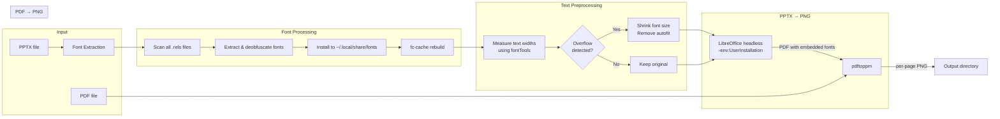
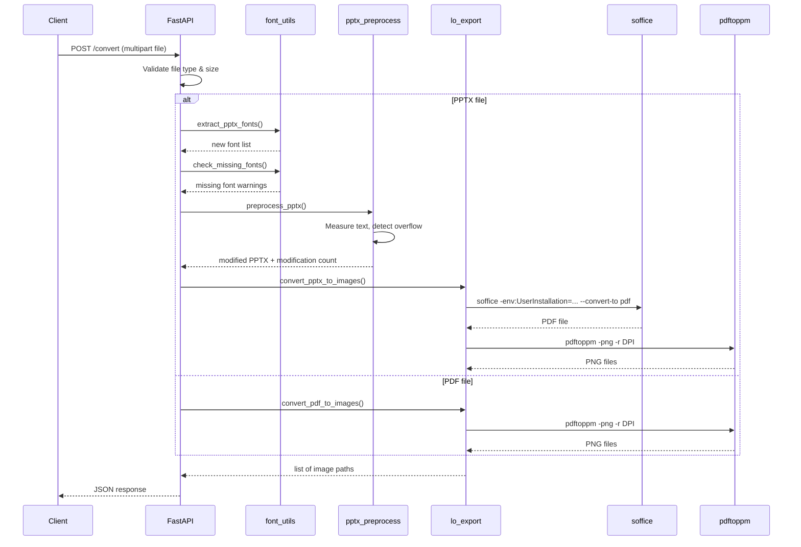

# Architecture

## Conversion Pipeline



## Component Responsibilities

| Module | Purpose |
|--------|---------|
| `server.py` | FastAPI HTTP service with upload, progress tracking, SSE |
| `docs2image.py` | CLI tool with same conversion logic |
| `font_utils.py` | Font extraction from PPTX, installation, missing font detection |
| `lo_export.py` | LibreOffice PDF export with isolated profile, pdftoppm rendering |
| `pptx_preprocess.py` | Text overflow detection and correction using fontTools |
| `run.py` | Service entry point |
| `static/index.html` | Web UI dashboard |

## Key Design Decisions

### LibreOffice Profile Isolation

LibreOffice uses `-env:UserInstallation=file:///tmp/...` to avoid lock conflicts between concurrent conversions. **Critical**: we do NOT override `HOME`, because that breaks fontconfig's access to `~/.local/share/fonts/`.

### Text Overflow Preprocessing

LibreOffice renders text ~13% wider than PowerPoint. Rather than trying to modify LibreOffice's behavior, we pre-process the PPTX:

1. Parse each slide's XML for text shapes
2. Measure text width using actual glyph metrics from installed font files
3. Compare against the visual container width (background rectangles)
4. Shrink only the overflowing text boxes and disable `normAutofit`

### Background Rectangle Detection

PPTX title text often sits in a shape that spans the full slide, but visually appears inside a narrower colored banner. The preprocessor finds filled rectangles on each slide and constrains text width to the banner width, not the text shape width.

## Data Flow (HTTP Request)



## File Layout

```
docs2image/
├── run.py                  # HTTP service entry point
├── install.sh              # Automated installer
├── requirements.txt        # Python dependencies
├── docs2image.service      # systemd unit template
├── src/
│   ├── __init__.py
│   ├── server.py           # FastAPI HTTP service
│   ├── docs2image.py       # CLI tool
│   ├── font_utils.py       # Font extraction & management
│   ├── lo_export.py        # LibreOffice export pipeline
│   └── pptx_preprocess.py  # Text overflow preprocessor
├── static/
│   └── index.html          # Web UI dashboard
├── docs/
│   ├── architecture.md     # This file
│   ├── fonts.md            # Font handling guide
│   └── upgrading.md        # Migration guide
├── examples/
│   ├── n8n-integration.md  # n8n workflow setup
│   └── docker-compose.yml  # Traefik/Nginx serving
└── output/                 # Generated images (per session UUID)
```
