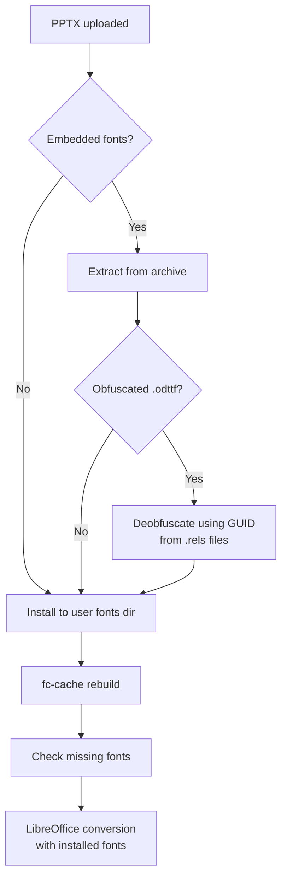

# Font Handling Guide

## The Problem

PPTX files created in PowerPoint on Windows/macOS often use fonts that aren't available on Linux:

- **Microsoft core fonts**: Arial, Times New Roman, Courier New, Calibri, etc.
- **Custom/commercial fonts**: embedded in the PPTX as obfuscated `.odttf` files
- **CJK and international fonts**: referenced by slide masters and themes

When LibreOffice can't find a font, it substitutes a fallback — and the fallback has different character widths, line heights, and kerning. This causes text to overflow boxes, wrap differently, or look wrong.

## How docs2image Solves This



### Step 1: Comprehensive Font Extraction

Unlike basic approaches that only check `ppt/_rels/presentation.xml.rels`, docs2image scans **every** `.rels` file in the archive:

- `ppt/_rels/presentation.xml.rels`
- `ppt/slides/_rels/slide*.xml.rels`
- `ppt/slideMasters/_rels/slideMaster*.xml.rels`
- `ppt/slideLayouts/_rels/slideLayout*.xml.rels`
- `ppt/theme/_rels/theme*.xml.rels`
- `[Content_Types].xml` (font MIME type declarations)

It also finds fonts by file extension anywhere in the archive, not just under `ppt/fonts/`.

### Step 2: ODTTF Deobfuscation

PowerPoint obfuscates embedded fonts using the OOXML spec (ECMA-376 Part 1 §14.2.7.2). The first 32 bytes are XOR'd with a GUID derived from the font's relationship ID. docs2image:

1. Builds a GUID map from all `.rels` files
2. Matches each `.odttf`/`.fntdata` file to its GUID
3. Falls back to filename matching if the path doesn't match exactly
4. Validates the deobfuscated font by checking the TrueType/OpenType signature

### Step 3: Font Installation

Fonts are installed to `~/.local/share/fonts/pptx-extracted/` — the standard XDG user font directory. This is automatically picked up by:

- **fontconfig** (`fc-cache`)
- **LibreOffice** (reads fontconfig)
- **Poppler/pdftoppm** (reads fontconfig)

### Step 4: Missing Font Detection

After extraction, docs2image parses all DrawingML XML to find every `typeface` reference and compares against `fc-list`. Missing fonts are logged as warnings.

## Recommended System Fonts

For best results on Ubuntu/Debian, install these packages:

```bash
# Microsoft core fonts (Arial, Times New Roman, Courier New, etc.)
sudo apt install ttf-mscorefonts-installer

# Liberation fonts (metric-compatible replacements)
sudo apt install fonts-liberation

# Additional recommended fonts
sudo apt install fonts-dejavu fonts-noto fonts-freefont-ttf
```

### Font Coverage

| Package                       | Covers                                    |
| ----------------------------- | ----------------------------------------- |
| `ttf-mscorefonts-installer`   | Arial, Times New Roman, Courier New, etc. |
| `fonts-liberation`             | Metric-compatible alternatives            |
| `fonts-noto`                   | CJK and international scripts             |
| `fonts-dejavu`                 | Extended Unicode coverage                 |

## Verifying Font Availability

```bash
# Check if a specific font is available
fc-list | grep -i "arial"

# List all installed font families
fc-list --format="%{family}\n" | sort -u

# Check which fonts a PPTX needs (using the CLI tool)
python src/docs2image.py presentation.pptx --verbose
```

## Troubleshooting

### Text overflows boxes

1. Check the missing fonts warning in the output
2. Install the missing fonts or their metric-compatible alternatives
3. Re-run the conversion

### Fonts look different but don't overflow

LibreOffice may substitute a visually similar but metrically identical font. This is usually acceptable. For pixel-perfect output matching PowerPoint on Windows, you need the exact same fonts installed.

### Embedded fonts not being extracted

Run with `--verbose` to see which `.rels` files are being scanned and which fonts are found. If a font uses an unusual embedding method, file an issue.

### fc-cache not picking up new fonts

```bash
# Force rebuild all font caches
fc-cache -f -v

# Verify the font is registered
fc-match "Font Name"
```
