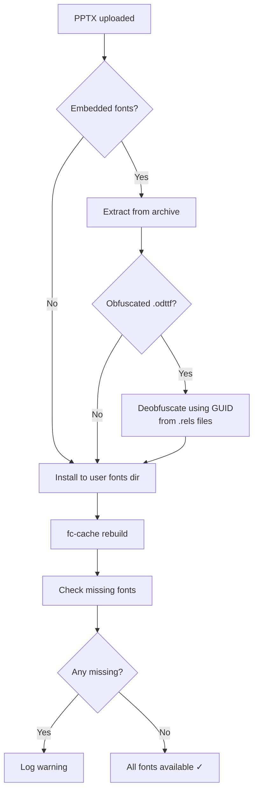
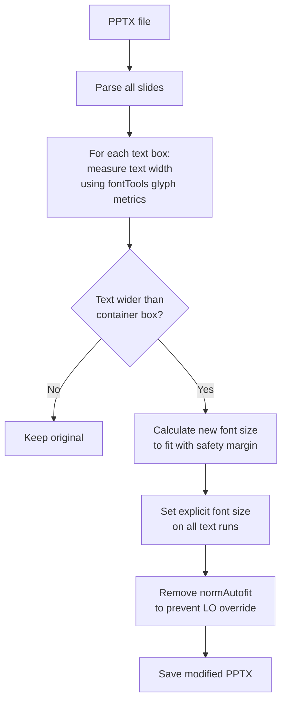

# Font Handling Guide

## Why Fonts Matter

PPTX files reference fonts by name. When the exact font isn't available on the server, LibreOffice substitutes a different font with different character widths. This causes text to overflow boxes, wrap differently, or look wrong.

**The single most important thing for accurate PPTX rendering is having the right fonts installed.**

## Required Font Installation

### Microsoft 365 Fonts (REQUIRED)

Most PPTX files use Microsoft fonts (Arial, Calibri, Aptos, Times New Roman, etc.). Install the full set:

```bash
# Clone the font collection
git clone --depth 1 https://github.com/pjobson/Microsoft-365-Fonts.git /tmp/ms-fonts

# Install to user font directory
mkdir -p ~/.local/share/fonts/ms365
find /tmp/ms-fonts -name "*.ttf" -exec cp {} ~/.local/share/fonts/ms365/ \;

# Rebuild font cache
fc-cache -f

# Clean up
rm -rf /tmp/ms-fonts
```

This installs ~2100 fonts including:
- **Aptos / Aptos Display** — new Microsoft 365 default (since 2023)
- **Calibri** — previous Office default
- **Arial, Times New Roman, Courier New** — classic fonts
- **Segoe UI** — Windows system font
- All CJK and international fonts

### Google Fonts (as needed)

Some presentations use Google Fonts. Install individually:

```bash
# Example: Play font
curl -sL "https://github.com/google/fonts/raw/main/ofl/play/Play-Regular.ttf" \
  -o ~/.local/share/fonts/ms365/Play-Regular.ttf
curl -sL "https://github.com/google/fonts/raw/main/ofl/play/Play-Bold.ttf" \
  -o ~/.local/share/fonts/ms365/Play-Bold.ttf
fc-cache -f
```

### Verifying Font Installation

```bash
# Check specific fonts
fc-match "Arial"           # → Arial.ttf: "Arial" "Regular"
fc-match "Aptos Display"   # → Aptos Display.ttf: "Aptos" "Display"
fc-match "Play"            # → Play-Regular.ttf: "Play" "Regular"

# List all installed font families
fc-list --format="%{family}\n" | sort -u | wc -l

# Check which fonts a PPTX needs
PYTHONPATH=src python src/docs2image.py presentation.pptx --verbose
# Look for "Missing fonts:" in the output
```

## How Font Extraction Works



docs2image scans **every** `.rels` file in the PPTX archive for embedded fonts — not just `presentation.xml.rels`. This catches fonts referenced from slides, slide masters, layouts, and themes.

## How the Text Overflow Preprocessor Works

Even with correct fonts installed, LibreOffice renders text ~13% wider than PowerPoint. The preprocessor compensates:



The preprocessor uses actual glyph widths from installed font files (via fontTools) multiplied by an empirically measured LibreOffice expansion factor.

## Troubleshooting

### Text overflows boxes

1. Check the conversion log for "Missing fonts" warnings
2. Install the missing fonts
3. Run `fc-cache -f`
4. Restart the service and re-convert

### Fonts look different but don't overflow

LibreOffice may substitute a visually similar font. Install the exact font for pixel-perfect output.

### Embedded fonts not being extracted

Run with `--verbose` to see font extraction details. Check if the font uses an unusual embedding method.

### fc-cache not picking up new fonts

```bash
fc-cache -f -v
fc-match "Font Name"
```
