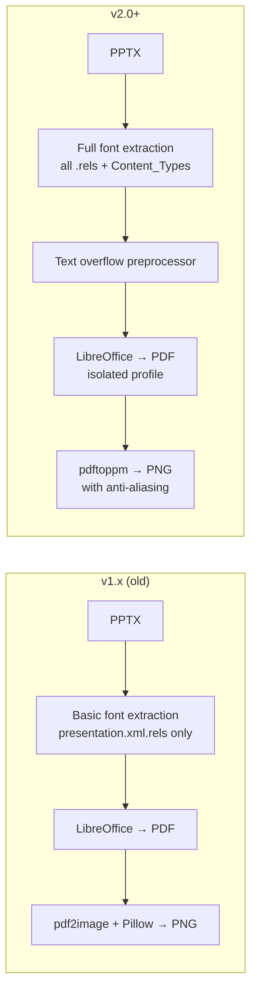

# Upgrading from Previous Versions

## v2.x → v2.1 (Current)

### What Changed

- **Font isolation fix**: LibreOffice now uses `-env:UserInstallation` for profile isolation instead of overriding `HOME`. This preserves fontconfig access to user-installed fonts.
- **Text overflow preprocessor**: Before converting, the system measures text widths using actual font metrics (fontTools) and shrinks text boxes that would overflow their visual containers in LibreOffice.
- **Web UI with live conversion log**: Dashboard shows real-time conversion progress, font status, and missing font warnings.
- **fonttools** added as a dependency.

### Migration Steps

```bash
# 1. Stop the service
sudo systemctl stop docs2image

# 2. Pull latest code
cd /path/to/docs2image
git pull origin main

# 3. Rebuild virtual environment
rm -rf venv
python3 -m venv venv
venv/bin/pip install -r requirements.txt

# 4. Install Microsoft 365 fonts (REQUIRED for PPTX rendering)
# See docs/fonts.md for details
git clone --depth 1 https://github.com/pjobson/Microsoft-365-Fonts.git /tmp/ms-fonts
mkdir -p ~/.local/share/fonts/ms365
find /tmp/ms-fonts -name "*.ttf" -exec cp {} ~/.local/share/fonts/ms365/ \;
fc-cache -f
rm -rf /tmp/ms-fonts

# 5. Install additional fonts if needed
# Google "Play" font (used in some presentations):
curl -sL "https://github.com/google/fonts/raw/main/ofl/play/Play-Regular.ttf" \
  -o ~/.local/share/fonts/ms365/Play-Regular.ttf
curl -sL "https://github.com/google/fonts/raw/main/ofl/play/Play-Bold.ttf" \
  -o ~/.local/share/fonts/ms365/Play-Bold.ttf
fc-cache -f

# 6. Verify fonts are installed
fc-match "Arial"          # Should show Arial.ttf
fc-match "Aptos Display"  # Should show Aptos Display.ttf
fc-match "Play"           # Should show Play-Regular.ttf

# 7. Regenerate service file and restart
./install.sh
sudo cp docs2image.service.generated /etc/systemd/system/docs2image.service
sudo systemctl daemon-reload
sudo systemctl start docs2image

# 8. Verify
curl http://localhost:8085/health
```

### Verify Font Rendering

After upgrading, test with a PPTX file:

```bash
# Quick CLI test
source venv/bin/activate
PYTHONPATH=src python src/docs2image.py test.pptx --verbose

# Check for missing font warnings in the output
# If you see "Missing fonts: X, Y" — install those fonts
```

---

## v1.x → v2.0

### What Changed



### Breaking Changes

| Area | v1.x | v2.0+ |
|------|------|-------|
| Project structure | All `.py` files in root | Source code in `src/` |
| Font directory | `./fonts/` (project-local) | `~/.local/share/fonts/` (user-wide) |
| Python deps | `pdf2image`, `Pillow` | `fonttools` (pdf2image/Pillow removed) |
| System deps | Same | Same (poppler-utils, libreoffice-impress) |
| Entry point | `python server.py` | `python run.py` or `uvicorn src.server:app` |
| CLI | `python docs2image.py` | `python src/docs2image.py` |
| API contract | ✅ Unchanged | ✅ Unchanged (new fields added) |

### Full Migration from v1.x

Follow the v2.x migration steps above. Additionally:

```bash
# Migrate old extracted fonts (optional)
cp fonts/*.ttf ~/.local/share/fonts/pptx-extracted/ 2>/dev/null
fc-cache -f
```

### Output Compatibility

The output format is fully compatible:
- Same directory structure: `output/{session_id}/page_001.png`
- Same JSON response from `/convert`
- Same image naming convention
- New fields in API response: `missing_fonts`, `new_fonts`, `filename`
