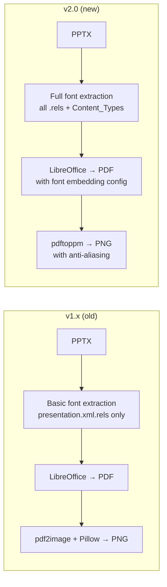

# Upgrading from Previous Versions

## v1.x → v2.0 (Current)

Version 2.0 is a major rewrite of the conversion pipeline focused on fixing font rendering issues with PPTX files.

### What Changed



### Breaking Changes

| Area | v1.x | v2.0 |
|------|------|------|
| Project structure | All `.py` files in root | Source code in `src/` |
| Font directory | `./fonts/` (project-local) | `~/.local/share/fonts/pptx-extracted/` (user-wide) |
| Python deps | `pdf2image`, `Pillow` | Neither (removed) |
| System deps | Same | Same (poppler-utils, libreoffice-impress) |
| Entry point | `python server.py` | `python run.py` or `uvicorn src.server:app` |
| CLI | `python docs2image.py` | `python src/docs2image.py` |
| API contract | ✅ Unchanged | ✅ Unchanged |

### Migration Steps

#### 1. Stop the running service

```bash
sudo systemctl stop docs2image
```

#### 2. Back up your current installation

```bash
cp -r /path/to/docs2image /path/to/docs2image.bak
```

#### 3. Pull the new code

```bash
cd /path/to/docs2image
git fetch origin
git checkout pptx-fix
git pull
```

#### 4. Recreate the virtual environment

The dependencies changed — `pdf2image` and `Pillow` are no longer needed.

```bash
rm -rf venv
python3 -m venv venv
venv/bin/pip install -r requirements.txt
```

#### 5. Install recommended system fonts

```bash
sudo apt install ttf-mscorefonts-installer fonts-liberation
```

#### 6. Migrate extracted fonts (optional)

If you had previously extracted fonts in the old `./fonts/` directory:

```bash
mkdir -p ~/.local/share/fonts/pptx-extracted
cp fonts/*.ttf fonts/*.otf ~/.local/share/fonts/pptx-extracted/ 2>/dev/null
fc-cache -f ~/.local/share/fonts/pptx-extracted
```

You can then remove the old `./fonts/` directory.

#### 7. Update the systemd service

```bash
# Re-run the installer to generate new configs
./install.sh

# Or manually update the service file
sudo cp docs2image.service.generated /etc/systemd/system/docs2image.service
sudo systemctl daemon-reload
```

#### 8. Start the service

```bash
sudo systemctl start docs2image
```

#### 9. Verify

```bash
# Health check
curl http://localhost:8085/health

# Test conversion
curl -X POST http://localhost:8085/convert -F "file=@test.pptx"
```

### Rollback

If you need to revert:

```bash
sudo systemctl stop docs2image
cd /path/to/docs2image
git checkout main   # or your previous branch/tag
rm -rf venv
python3 -m venv venv
venv/bin/pip install -r requirements.txt
sudo systemctl start docs2image
```

### Output Compatibility

The output format is fully compatible:

- Same directory structure: `output/{session_id}/page_001.png`
- Same JSON response from `/convert`
- Same image naming convention
- No changes needed in n8n workflows or other integrations

The only difference is **image quality** — v2.0 produces better-looking images with correct fonts.
